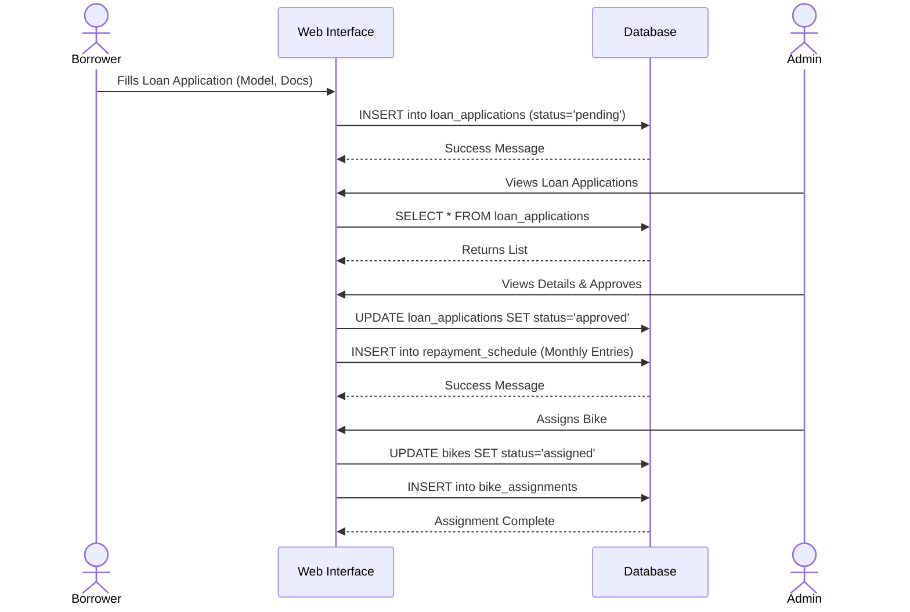
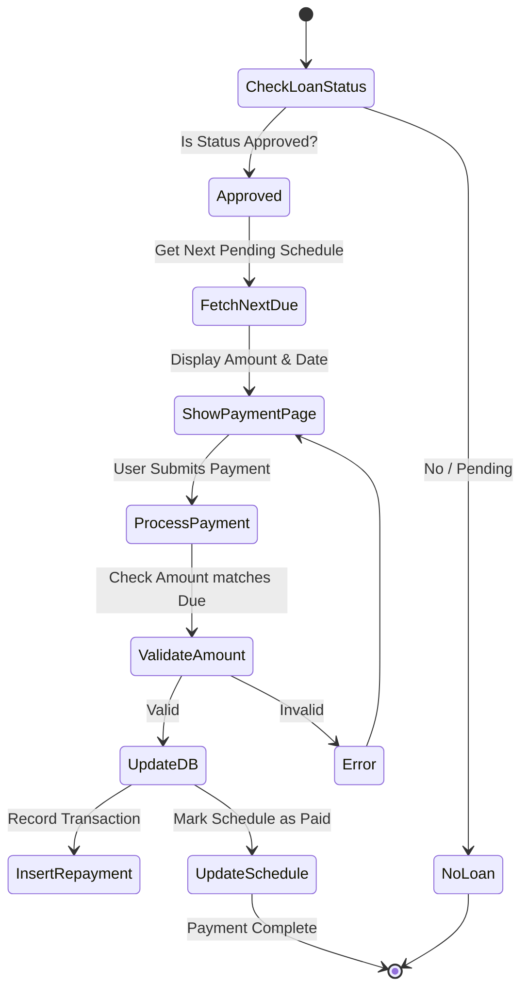

# Behavioral Diagrams

## Loan Application & Approval Process (Sequence Diagram)

```mermaid
sequenceDiagram
    actor Borrower
    participant UI as Web Interface
    participant DB as Database
    actor Admin

    Borrower->>UI: Fills Loan Application (Model, Docs)
    UI->>DB: INSERT into loan_applications (status='pending')
    DB-->>UI: Success Message

    Admin->>UI: Views Loan Applications
    UI->>DB: SELECT * FROM loan_applications
    DB-->>UI: Returns List

    Admin->>UI: Views Details & Approves
    UI->>DB: UPDATE loan_applications SET status='approved'
    UI->>DB: INSERT into repayment_schedule (Monthly Entries)
    DB-->>UI: Success Message

    Admin->>UI: Assigns Bike
    UI->>DB: UPDATE bikes SET status='assigned'
    UI->>DB: INSERT into bike_assignments
    DB-->>UI: Assignment Complete
```

## Repayment Process (Activity Diagram)

```mermaid
stateDiagram-v2
    [*] --> CheckLoanStatus
    CheckLoanStatus --> Approved: Is Status Approved?
    CheckLoanStatus --> NoLoan: No / Pending
    NoLoan --> [*]

    Approved --> FetchNextDue: Get Next Pending Schedule
    FetchNextDue --> ShowPaymentPage: Display Amount & Date

    ShowPaymentPage --> ProcessPayment: User Submits Payment
    ProcessPayment --> ValidateAmount: Check Amount matches Due

    ValidateAmount --> UpdateDB: Valid
    ValidateAmount --> Error: Invalid
    Error --> ShowPaymentPage

    UpdateDB --> InsertRepayment: Record Transaction
    UpdateDB --> UpdateSchedule: Mark Schedule as Paid

    UpdateSchedule --> [*]: Payment Complete
```
