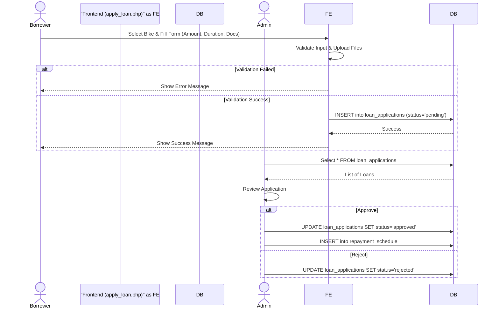

# Behavioral Diagrams

## Sequence Diagram: Loan Application Process

```mermaid
sequenceDiagram
    actor Borrower
    participant "Frontend (apply_loan.php)" as FE
    participant "Database" as DB
    actor Admin

    Borrower->>FE: Select Bike & Fill Form (Amount, Duration, Docs)
    FE->>FE: Validate Input & Upload Files
    alt Validation Failed
        FE-->>Borrower: Show Error Message
    else Validation Success
        FE->>DB: INSERT into loan_applications (status='pending')
        DB-->>FE: Success
        FE-->>Borrower: Show Success Message
    end

    Admin->>DB: Select * FROM loan_applications
    DB-->>Admin: List of Loans
    Admin->>Admin: Review Application
    alt Approve
        Admin->>DB: UPDATE loan_applications SET status='approved'
        Admin->>DB: INSERT into repayment_schedule
    else Reject
        Admin->>DB: UPDATE loan_applications SET status='rejected'
    end
```
