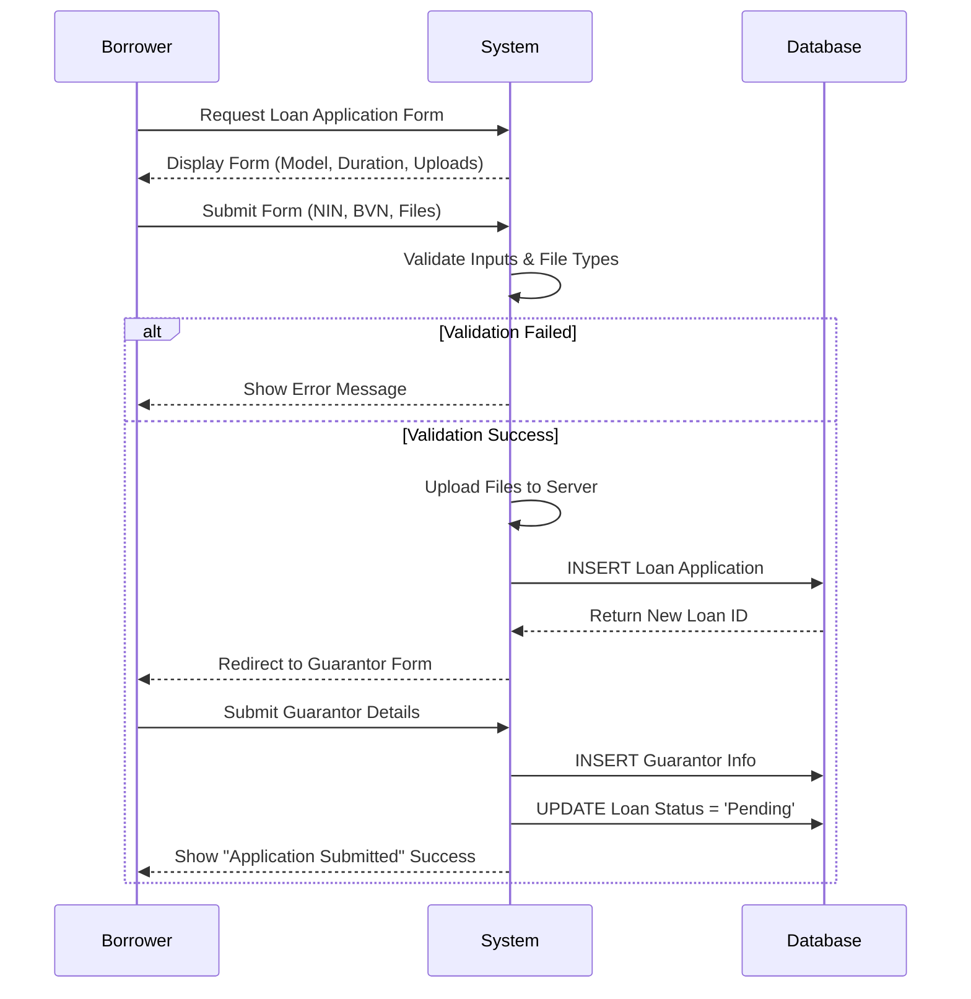

# Behavioral Diagrams

## 1. Sequence Diagram: Loan Application Process
This diagram illustrates the interaction between the Borrower, the System, and the Database during a loan application.



## 2. Activity Diagram: Loan Approval Process
This diagram shows the flow of actions when an Admin reviews a loan.

```mermaid
flowchart TD
    A[Start] --> B{Admin Logs In}
    B -- Success --> C[View Pending Loans]
    C --> D[Select Loan Application]
    D --> E[Review Documents & Guarantor]

    E --> F{Decision?}

    F -- Approve --> G[Update Status to 'Approved']
    G --> H[Calculate Interest]
    H --> I[Generate Repayment Schedule]
    I --> J[Notify Borrower (Simulated)]

    F -- Reject --> K[Update Status to 'Rejected']
    K --> L[Notify Borrower (Simulated)]

    J --> M[End]
    L --> M
```
