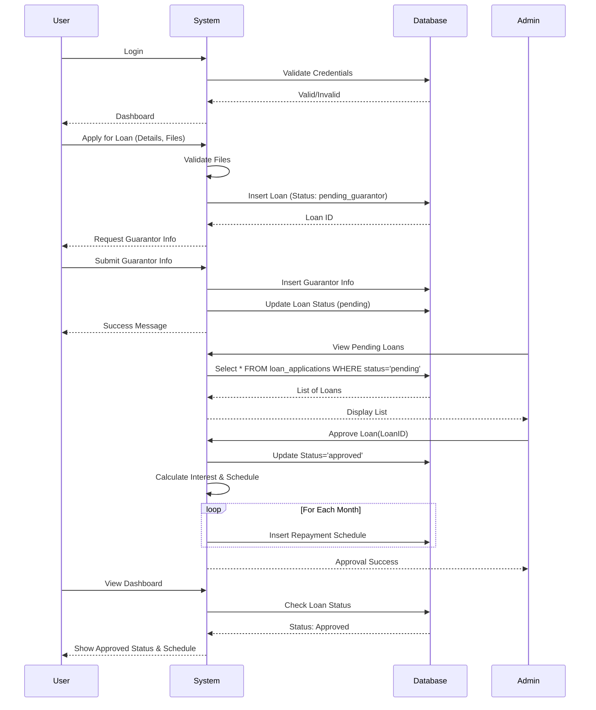

# Behavioral Diagrams

## Sequence Diagram: Loan Application & Approval Flow

```mermaid
sequenceDiagram
    participant User
    participant System
    participant Database
    participant Admin

    User->>System: Login
    System->>Database: Validate Credentials
    Database-->>System: Valid/Invalid
    System-->>User: Dashboard

    User->>System: Apply for Loan (Details, Files)
    System->>System: Validate Files
    System->>Database: Insert Loan (Status: pending_guarantor)
    Database-->>System: Loan ID
    System-->>User: Request Guarantor Info

    User->>System: Submit Guarantor Info
    System->>Database: Insert Guarantor Info
    System->>Database: Update Loan Status (pending)
    System-->>User: Success Message

    Admin->>System: View Pending Loans
    System->>Database: Select * FROM loan_applications WHERE status='pending'
    Database-->>System: List of Loans
    System-->>Admin: Display List

    Admin->>System: Approve Loan(LoanID)
    System->>Database: Update Status='approved'
    System->>System: Calculate Interest & Schedule
    loop For Each Month
        System->>Database: Insert Repayment Schedule
    end
    System-->>Admin: Approval Success

    User->>System: View Dashboard
    System->>Database: Check Loan Status
    Database-->>System: Status: Approved
    System-->>User: Show Approved Status & Schedule
```
