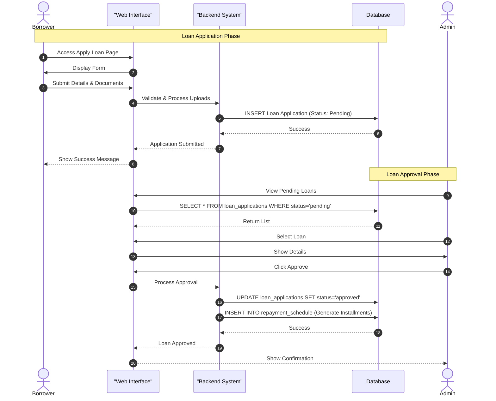
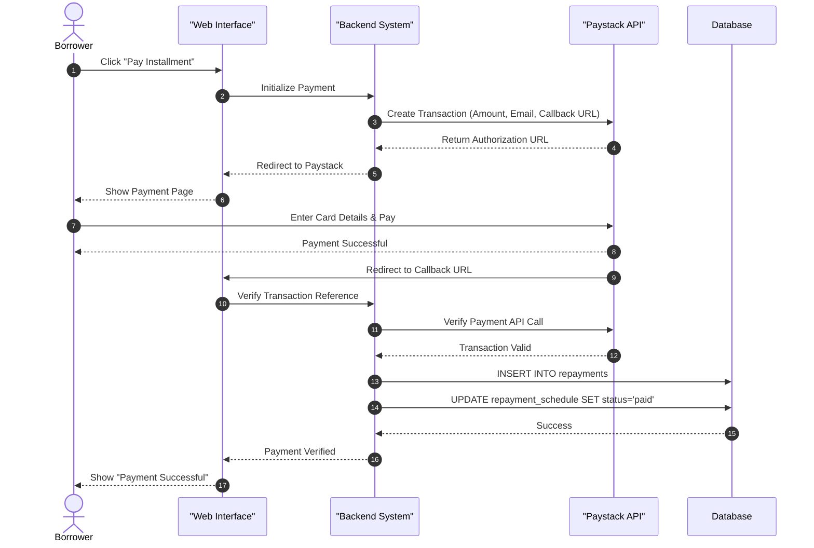

# Behavioral Diagrams

## Sequence Diagram: Loan Application & Approval Process

```mermaid
sequenceDiagram
    autonumber
    actor Borrower
    participant WebInterface as "Web Interface"
    participant System as "Backend System"
    participant Database
    actor Admin

    Note over Borrower, Database: Loan Application Phase
    Borrower->>WebInterface: Access Apply Loan Page
    WebInterface->>Borrower: Display Form
    Borrower->>WebInterface: Submit Details & Documents
    WebInterface->>System: Validate & Process Uploads
    System->>Database: INSERT Loan Application (Status: Pending)
    Database-->>System: Success
    System-->>WebInterface: Application Submitted
    WebInterface-->>Borrower: Show Success Message

    Note over Admin, Database: Loan Approval Phase
    Admin->>WebInterface: View Pending Loans
    WebInterface->>Database: SELECT * FROM loan_applications WHERE status='pending'
    Database-->>WebInterface: Return List
    Admin->>WebInterface: Select Loan #123
    WebInterface->>Admin: Show Details
    Admin->>WebInterface: Click Approve
    WebInterface->>System: Process Approval
    System->>Database: UPDATE loan_applications SET status='approved'
    System->>Database: INSERT INTO repayment_schedule (Generate Installments)
    Database-->>System: Success
    System-->>WebInterface: Loan Approved
    WebInterface-->>Admin: Show Confirmation
```

## Sequence Diagram: Repayment Process

```mermaid
sequenceDiagram
    autonumber
    actor Borrower
    participant WebInterface as "Web Interface"
    participant System as "Backend System"
    participant Paystack as "Paystack API"
    participant Database

    Borrower->>WebInterface: Click "Pay Installment"
    WebInterface->>System: Initialize Payment
    System->>Paystack: Create Transaction (Amount, Email, Callback URL)
    Paystack-->>System: Return Authorization URL
    System-->>WebInterface: Redirect to Paystack
    WebInterface-->>Borrower: Show Payment Page
    Borrower->>Paystack: Enter Card Details & Pay
    Paystack-->>Borrower: Payment Successful
    Paystack->>WebInterface: Redirect to Callback URL
    WebInterface->>System: Verify Transaction Reference
    System->>Paystack: Verify Payment API Call
    Paystack-->>System: Transaction Valid
    System->>Database: INSERT INTO repayments
    System->>Database: UPDATE repayment_schedule SET status='paid'
    Database-->>System: Success
    System-->>WebInterface: Payment Verified
    WebInterface-->>Borrower: Show "Payment Successful"
```
