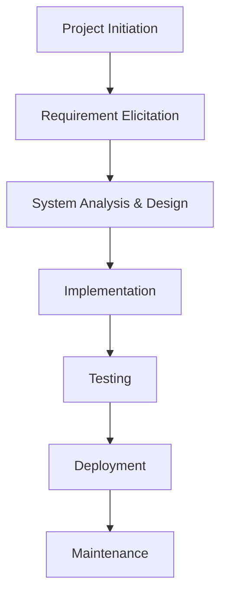
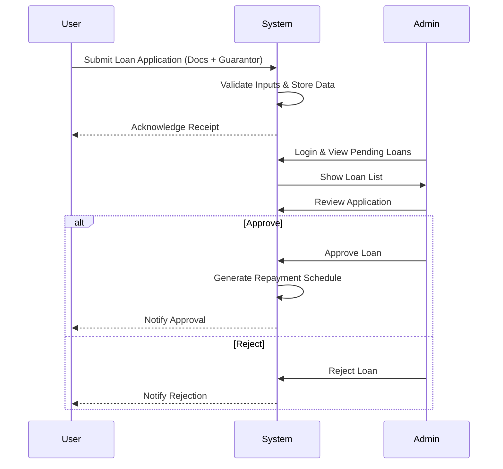
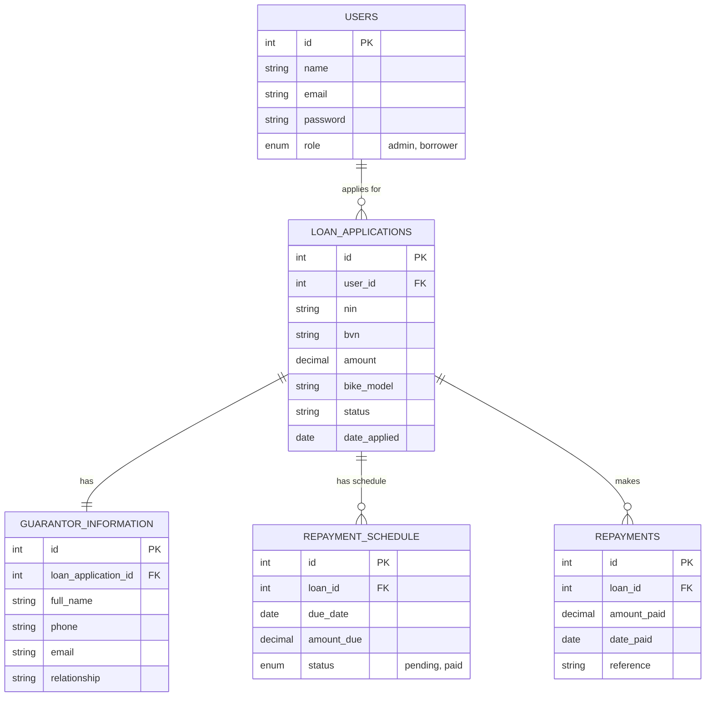

# Chapter Three: Methodology

## 3.1 Introduction
This chapter outlines the methodology and system design employed in the development of the Electric Bike Loan Management System. It details the project workflow, the chosen system development model, and the analysis of both the existing and proposed systems. Furthermore, it presents the system design, including the architectural and database designs, to provide a comprehensive understanding of the system's structure and functionality.

## 3.2 Project Workflow
The project follows a structured workflow to ensure successful development and implementation. The key stages are illustrated in Figure 3.1 below.


*Figure 3.1: Project Workflow Diagram*

## 3.3 System Development Model
The **Waterfall Model** was selected for the development of this system. This linear sequential life cycle model allows for a disciplined approach where each phase must be completed before the next begins. This is suitable for this project as the requirements were well-understood and defined from the outset (Chapter 1). The phases include:
1.  **Requirement Analysis**: Gathering and analyzing user needs.
2.  **System Design**: Creating the architecture and database structure.
3.  **Implementation**: Coding the system using PHP and MySQL.
4.  **Testing**: Verifying the system functionalities.
5.  **Deployment**: Making the system available for use.
6.  **Maintenance**: Ongoing support and updates.

## 3.4 Analysis of Existing and Proposed System

### 3.4.1 Description of Existing System
The existing loan management process is primarily manual.
*   **Borrowers**: Applicants visit the office physically to collect paper forms. They must manually fill in details, attach photocopies of ID cards and utility bills, and submit them for review. Tracking the application status requires repeated physical visits or phone calls.
*   **Admins**: Staff manually review paper forms, verify documents, and calculate repayment schedules using calculators or spreadsheets. Records are stored in physical file cabinets, making retrieval and updates time-consuming and prone to errors (e.g., misplaced files).
*   **Repayments**: Borrowers pay via bank transfer or cash and submit proof of payment manually. Admins manually update ledgers, leading to potential discrepancies in balance calculations.

### 3.4.2 Requirement Elicitation
Requirements were gathered through simulated interviews with potential stakeholders (Borrowers and Admin Staff).
*   **Borrowers** expressed a need for:
    *   Online application submission to save travel time.
    *   Real-time status tracking of their loan application.
    *   Easy access to repayment schedules and history.
*   **Admins** highlighted the need for:
    *   Automated repayment calculations and tracking.
    *   Digital document storage for IDs and utility bills.
    *   A dashboard to view pending, approved, and rejected loans.

### 3.4.3 Requirements Definition

**User Requirements:**
*   **Borrowers** shall be able to:
    *   Register and log in securely.
    *   Apply for a loan by selecting an electric bike model and duration.
    *   Upload required documents (ID Card, Utility Bill).
    *   Provide Guarantor information.
    *   View loan status and repayment schedule.
    *   Make repayments (simulated or integrated) and view history.
*   **Administrators** shall be able to:
    *   View a dashboard of all loan activities.
    *   Review loan applications and documents.
    *   Approve or reject loans.
    *   Manage repayments and update statuses.
    *   Generate reports on loans and repayments.

**Non-Functional Requirements:**
*   **Security**: Passwords must be hashed. Access to admin pages must be restricted.
*   **Performance**: The system should load pages within 2 seconds under normal load.
*   **Reliability**: The system should ensure data integrity for all financial transactions.
*   **Usability**: The interface should be intuitive for users with basic digital literacy.

### 3.4.4 Requirement Analysis
The system's interactions are depicted in the Use Case Diagram below.

```mermaid
usecaseDiagram
    actor Borrower
    actor Admin

    usecase "Register/Login" as UC1
    usecase "Apply for Loan" as UC2
    usecase "Upload Documents" as UC3
    usecase "Provide Guarantor Info" as UC4
    usecase "View Loan Status" as UC5
    usecase "Make Repayment" as UC6
    usecase "Manage Applications" as UC7
    usecase "Approve/Reject Loan" as UC8
    usecase "View Reports" as UC9

    Borrower --> UC1
    Borrower --> UC2
    Borrower --> UC3
    Borrower --> UC4
    Borrower --> UC5
    Borrower --> UC6

    Admin --> UC1
    Admin --> UC7
    Admin --> UC8
    Admin --> UC9
```
*Figure 3.2: Use Case Diagram*

**Use Case Description: Apply for Loan**
*   **Actor**: Borrower
*   **Preconditions**: User is logged in.
*   **Normal Course**:
    1.  User selects "Apply Loan".
    2.  System displays bike models and calculates tentative repayment.
    3.  User enters personal details (NIN, BVN) and uploads files.
    4.  User submits form.
    5.  System prompts for Guarantor Information.
    6.  User enters Guarantor details and submits.
    7.  System saves application as "Pending".
*   **Post-condition**: Loan application is recorded in the database.

## 3.5 System Design

### 3.5.1 Description of Proposed System
The proposed system is a web-based application automating the loan lifecycle. The flow for a loan application is shown below.


*Figure 3.3: Sequence Diagram for Loan Application Process*

### 3.5.2 Architecture Design
The system uses a simple Model-View-Controller (MVC) inspired structure within core PHP.
*   **Presentation Layer (View)**: PHP files combining HTML/CSS (e.g., `dashboard.php`, `apply_loan.php`).
*   **Logic Layer (Controller)**: PHP scripts processing form data (embedded in files like `register.php`, `admin/approve_loan.php`).
*   **Data Layer (Model)**: `includes/db_connect.php` handles database connections; SQL queries interact with MySQL.

### 3.5.3 Database Design
The database `ebike_loan_db` stores all system data. The Entity-Relationship (ER) Diagram is shown below.


*Figure 3.4: Entity Relationship (ER) Diagram*

## 3.6 Summary
This chapter detailed the methodology and design of the Electric Bike Loan Management System. It established the Waterfall model as the development approach and analyzed the requirements based on stakeholder needs. The system design was visualized using Workflow, Use Case, Sequence, and ER diagrams, providing a blueprint for the implementation phase described in the next chapter.
