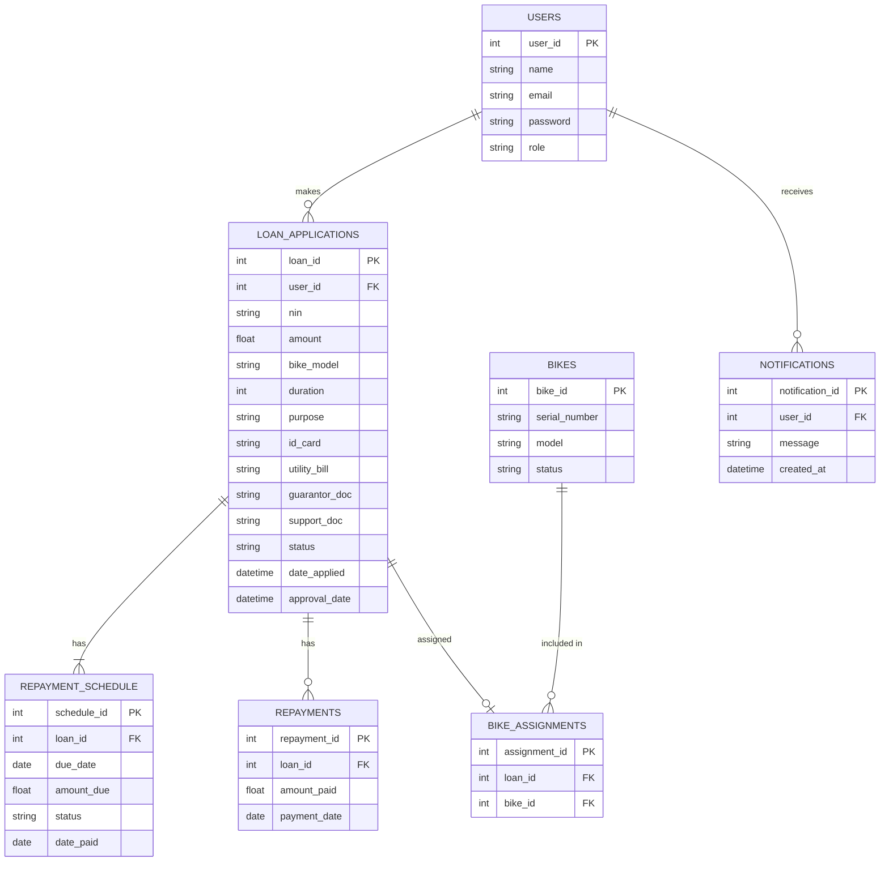

# Database Design (ER Diagram)

```mermaid
erDiagram
    USERS {
        int user_id PK
        string name
        string email
        string password
        string role
    }

    LOAN_APPLICATIONS {
        int loan_id PK
        int user_id FK
        string nin
        float amount
        string bike_model
        int duration
        string purpose
        string id_card
        string utility_bill
        string guarantor_doc
        string support_doc
        string status
        datetime date_applied
        datetime approval_date
    }

    BIKES {
        int bike_id PK
        string serial_number
        string model
        string status
    }

    BIKE_ASSIGNMENTS {
        int assignment_id PK
        int loan_id FK
        int bike_id FK
    }

    REPAYMENT_SCHEDULE {
        int schedule_id PK
        int loan_id FK
        date due_date
        float amount_due
        string status
        date date_paid
    }

    REPAYMENTS {
        int repayment_id PK
        int loan_id FK
        float amount_paid
        date payment_date
    }

    NOTIFICATIONS {
        int notification_id PK
        int user_id FK
        string message
        datetime created_at
    }

    USERS ||--o{ LOAN_APPLICATIONS : "makes"
    USERS ||--o{ NOTIFICATIONS : "receives"
    LOAN_APPLICATIONS ||--|{ REPAYMENT_SCHEDULE : "has"
    LOAN_APPLICATIONS ||--o{ REPAYMENTS : "has"
    LOAN_APPLICATIONS ||--o| BIKE_ASSIGNMENTS : "assigned"
    BIKES ||--o{ BIKE_ASSIGNMENTS : "included in"
```
