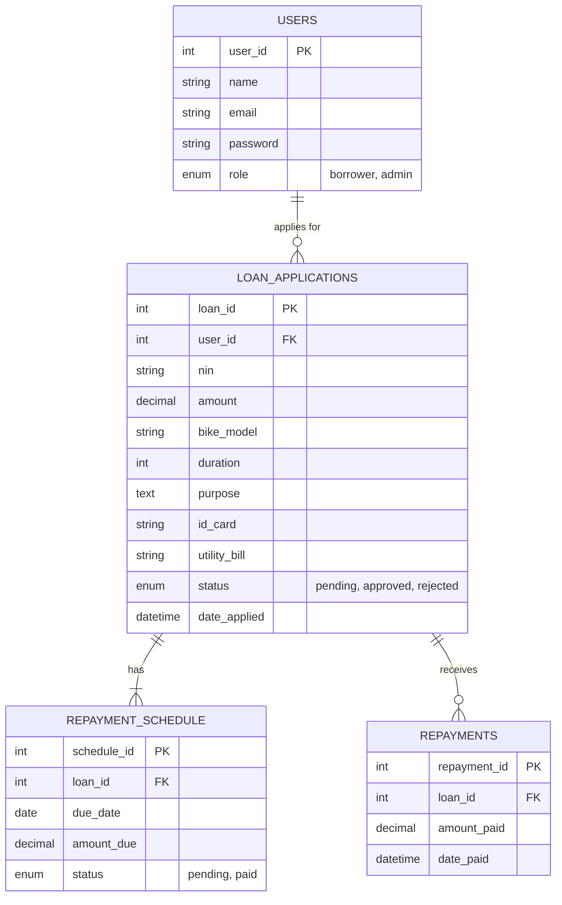

# Database Design

## Entity Relationship Diagram (ERD)

This diagram represents the database schema derived from the application code.

```mermaid
erDiagram
    USERS {
        int user_id PK
        string name
        string email
        string password
        enum role "borrower, admin"
    }

    LOAN_APPLICATIONS {
        int loan_id PK
        int user_id FK
        string nin
        decimal amount
        string bike_model
        int duration
        text purpose
        string id_card
        string utility_bill
        enum status "pending, approved, rejected"
        datetime date_applied
    }

    REPAYMENT_SCHEDULE {
        int schedule_id PK
        int loan_id FK
        date due_date
        decimal amount_due
        enum status "pending, paid"
    }

    REPAYMENTS {
        int repayment_id PK
        int loan_id FK
        decimal amount_paid
        datetime date_paid
    }

    USERS ||--o{ LOAN_APPLICATIONS : "applies for"
    LOAN_APPLICATIONS ||--|{ REPAYMENT_SCHEDULE : "has"
    LOAN_APPLICATIONS ||--o{ REPAYMENTS : "receives"
```
