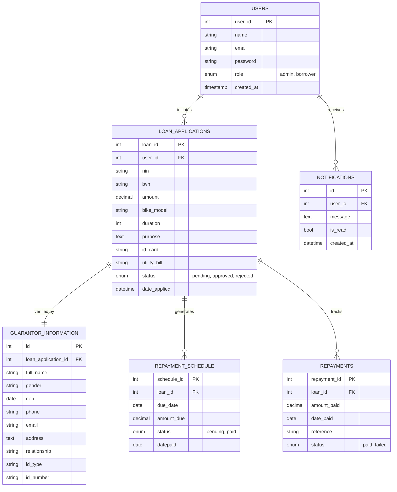

# Database Design

## Entity Relationship (ER) Diagram
This diagram represents the schema of the `ebike_loan_db` database.

```mermaid
erDiagram
    USERS {
        int user_id PK
        string name
        string email
        string password
        enum role "admin, borrower"
        timestamp created_at
    }

    LOAN_APPLICATIONS {
        int loan_id PK
        int user_id FK
        string nin
        string bvn
        decimal amount
        string bike_model
        int duration
        text purpose
        string id_card
        string utility_bill
        enum status "pending, approved, rejected"
        datetime date_applied
    }

    GUARANTOR_INFORMATION {
        int id PK
        int loan_application_id FK
        string full_name
        string gender
        date dob
        string phone
        string email
        text address
        string relationship
        string id_type
        string id_number
    }

    REPAYMENT_SCHEDULE {
        int schedule_id PK
        int loan_id FK
        date due_date
        decimal amount_due
        enum status "pending, paid"
        date datepaid
    }

    REPAYMENTS {
        int repayment_id PK
        int loan_id FK
        decimal amount_paid
        date date_paid
        string reference
        enum status "paid, failed"
    }

    NOTIFICATIONS {
        int id PK
        int user_id FK
        text message
        bool is_read
        datetime created_at
    }

    %% Relationships
    USERS ||--o{ LOAN_APPLICATIONS : "initiates"
    USERS ||--o{ NOTIFICATIONS : "receives"
    LOAN_APPLICATIONS ||--|| GUARANTOR_INFORMATION : "verified by"
    LOAN_APPLICATIONS ||--o{ REPAYMENT_SCHEDULE : "generates"
    LOAN_APPLICATIONS ||--o{ REPAYMENTS : "tracks"
```
