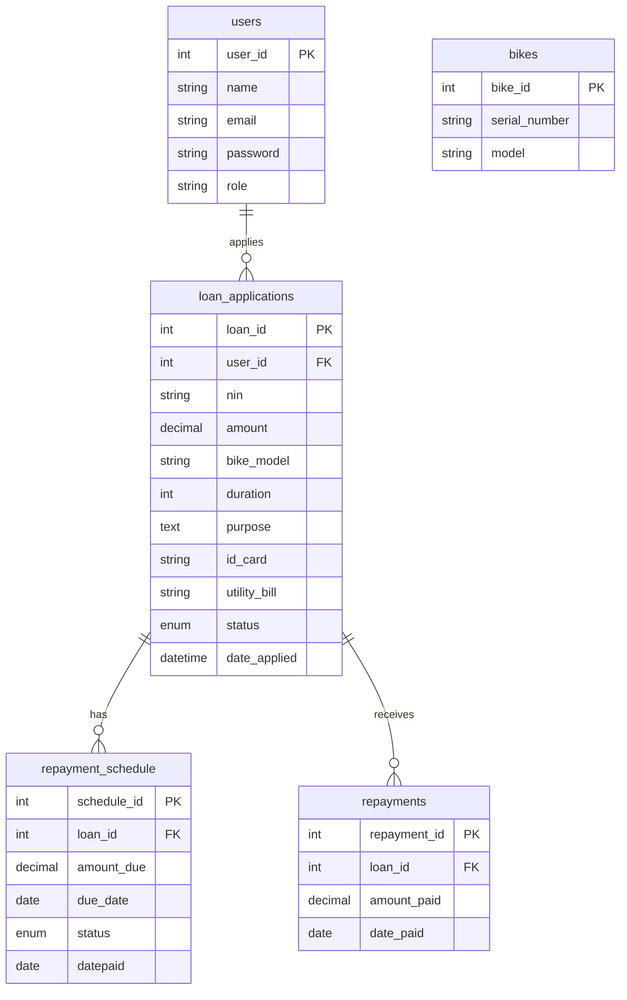

# Database Design

## ER Diagram

```mermaid
erDiagram
    users {
        int user_id PK
        string name
        string email
        string password
        string role
    }

    bikes {
        int bike_id PK
        string serial_number
        string model
    }

    loan_applications {
        int loan_id PK
        int user_id FK
        string nin
        decimal amount
        string bike_model
        int duration
        text purpose
        string id_card
        string utility_bill
        enum status
        datetime date_applied
    }

    repayment_schedule {
        int schedule_id PK
        int loan_id FK
        decimal amount_due
        date due_date
        enum status
        date datepaid
    }

    repayments {
        int repayment_id PK
        int loan_id FK
        decimal amount_paid
        date date_paid
    }

    users ||--o{ loan_applications : "applies"
    loan_applications ||--o{ repayment_schedule : "has"
    loan_applications ||--o{ repayments : "receives"
```
