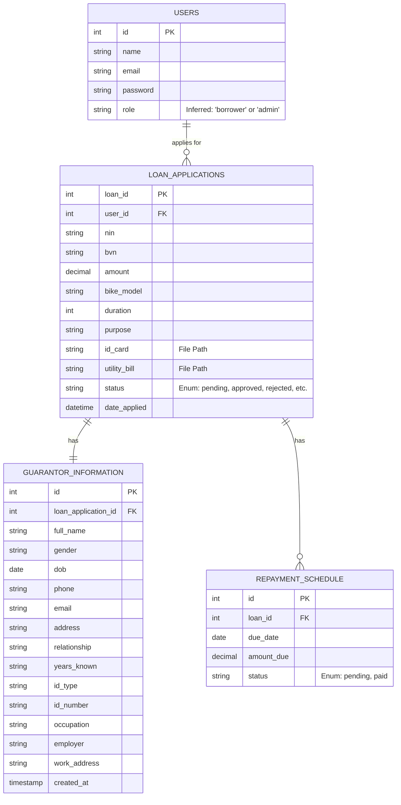

# Database Design

## ER Diagram

```mermaid
erDiagram
    USERS {
        int id PK
        string name
        string email
        string password
        string role "Inferred: 'borrower' or 'admin'"
    }

    LOAN_APPLICATIONS {
        int loan_id PK
        int user_id FK
        string nin
        string bvn
        decimal amount
        string bike_model
        int duration
        string purpose
        string id_card "File Path"
        string utility_bill "File Path"
        string status "Enum: pending, approved, rejected, etc."
        datetime date_applied
    }

    GUARANTOR_INFORMATION {
        int id PK
        int loan_application_id FK
        string full_name
        string gender
        date dob
        string phone
        string email
        string address
        string relationship
        string years_known
        string id_type
        string id_number
        string occupation
        string employer
        string work_address
        timestamp created_at
    }

    REPAYMENT_SCHEDULE {
        int id PK
        int loan_id FK
        date due_date
        decimal amount_due
        string status "Enum: pending, paid"
    }

    USERS ||--o{ LOAN_APPLICATIONS : "applies for"
    LOAN_APPLICATIONS ||--|| GUARANTOR_INFORMATION : "has"
    LOAN_APPLICATIONS ||--o{ REPAYMENT_SCHEDULE : "has"
```
