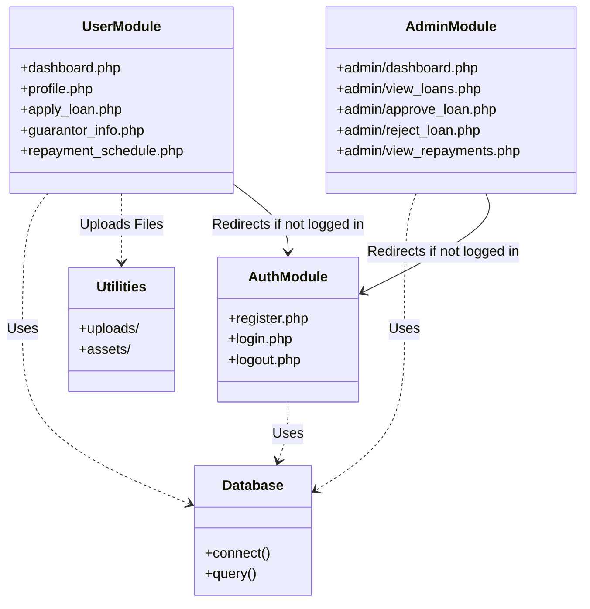

# Structural Diagrams

## Class/Module Diagram

Since the application uses core PHP (procedural/script-based) rather than a strict Object-Oriented structure, this diagram represents the relationship between key modules (files) and the database.

