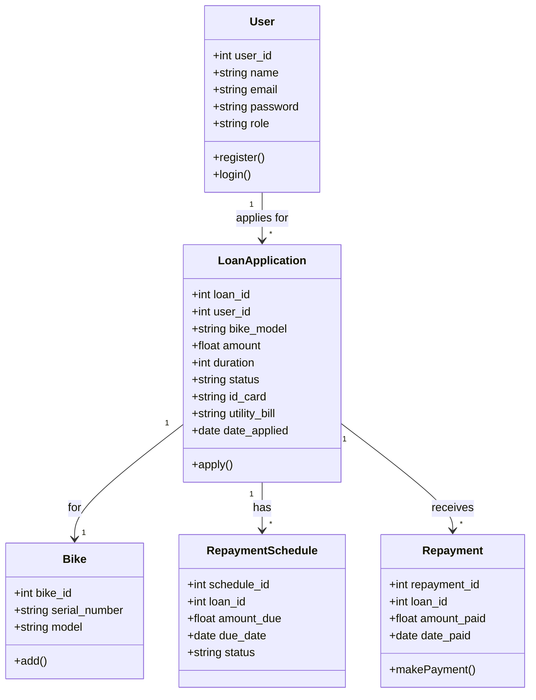

# Structural Diagrams

## Class Diagram (Conceptual)
Since the system is procedural PHP, this diagram represents the logical entities and their relationships as if they were classes.

```mermaid
classDiagram
    class User {
        +int user_id
        +string name
        +string email
        +string password
        +string role
        +register()
        +login()
    }

    class LoanApplication {
        +int loan_id
        +int user_id
        +string bike_model
        +float amount
        +int duration
        +string status
        +string id_card
        +string utility_bill
        +date date_applied
        +apply()
    }

    class Bike {
        +int bike_id
        +string serial_number
        +string model
        +add()
    }

    class RepaymentSchedule {
        +int schedule_id
        +int loan_id
        +float amount_due
        +date due_date
        +string status
    }

    class Repayment {
        +int repayment_id
        +int loan_id
        +float amount_paid
        +date date_paid
        +makePayment()
    }

    User "1" --> "*" LoanApplication : applies for
    LoanApplication "1" --> "1" Bike : for
    LoanApplication "1" --> "*" RepaymentSchedule : has
    LoanApplication "1" --> "*" Repayment : receives
```
