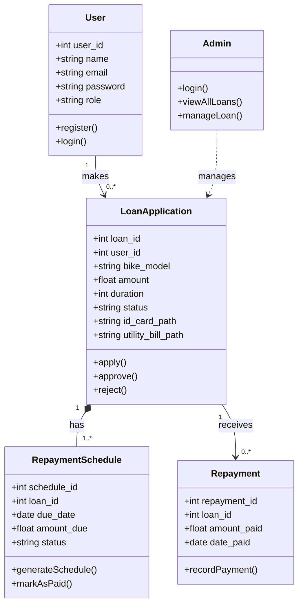

# Structural Diagrams

## Class Diagram (Logical Module Structure)

Since the application is built with procedural PHP, this diagram represents the logical entities and their relationships as if they were classes, reflecting the data model and associated logic modules.

