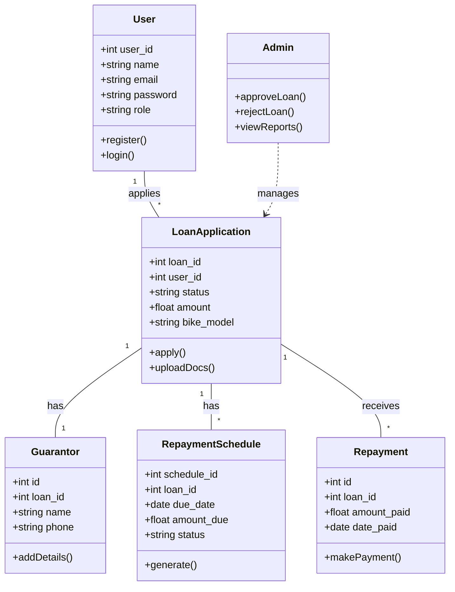

# Structural Diagrams

## Class Diagram (Conceptual)
Since the system is built with procedural PHP, this class diagram represents the logical modules and their relationships rather than strict OOP classes.

