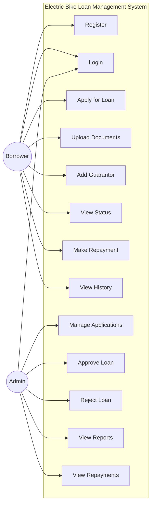

# Use Case Diagram

```mermaid
graph LR
    %% Actors
    Borrower((Borrower))
    Admin((Admin))

    %% System Boundary
    subgraph System [Electric Bike Loan Management System]
        direction TB

        %% Use Cases
        UC1[Register]
        UC2[Login]
        UC3[Apply for Loan]
        UC4[Upload Documents]
        UC5[Add Guarantor]
        UC6[View Status]
        UC7[Make Repayment]
        UC8[View History]

        UC9[Manage Applications]
        UC10[Approve Loan]
        UC11[Reject Loan]
        UC12[View Reports]
        UC13[View Repayments]
    end

    %% Relationships
    Borrower --> UC1
    Borrower --> UC2
    Borrower --> UC3
    Borrower --> UC4
    Borrower --> UC5
    Borrower --> UC6
    Borrower --> UC7
    Borrower --> UC8

    Admin --> UC2
    Admin --> UC9
    Admin --> UC10
    Admin --> UC11
    Admin --> UC12
    Admin --> UC13
```
